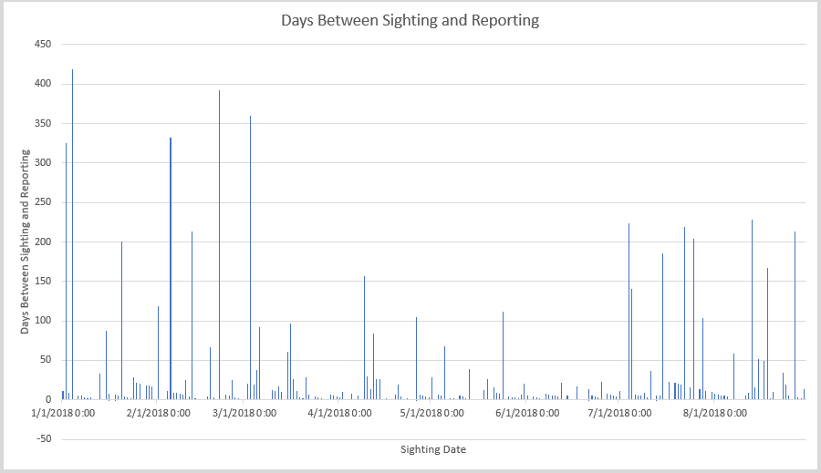

Theodore Bieber 
Data Science Homework 2
===
**Resources Used**
Data crawled+saved using https://github.com/RaInta/National_UFO_Reporting_Center/
Data trimmed using excel conditional statements and row deletions
Charts created with matplot.py and excel
Decision Tree created with scikit-learn
Decision Tree rendered with graphviz, and edited for color with MS Paint

# Part 1
From this first chart, we can see that the most reported shape is a circle. In almost every month, more circles were reported than triangles by a substantial amount. The number of reports per month doesn't seem to follow a pattern, but we can see that there is a peak in reports in july, followed by august. 

From the bar chart, we can't see any real trends. California and Florida report the most sightings, topped only by the total from every other place in the world outside the US. This is probably linked to population; the more people, the more likely that someone is going to report a UFO sighting. 

This next graph is an interesting one. It is the number of days between when the UFO was sighted and when it was reported. Frequently, over 350 days pass between someone seeing one and reporting it. This could be user error (they enter a wrong year by accident) or it could be that they suddenly remembered to report it. Something that I found interesting about this chart is that there are patterns where the number of days between sighting and reporting are trending downwards VERY evenly. I can't explain this, but it was interesting to see. 

# Part 2
Below is a visualization of the decision tree that I created with sklearn. The visualization was created with graphviz and MS Paint. I used paint to add color to it. 
The statistics for the classifier are below: 
False Positives: 35
False Negatives: 13
True Positives: 9
True Negatives: 76
Accuracy: 0.6390977443609023

