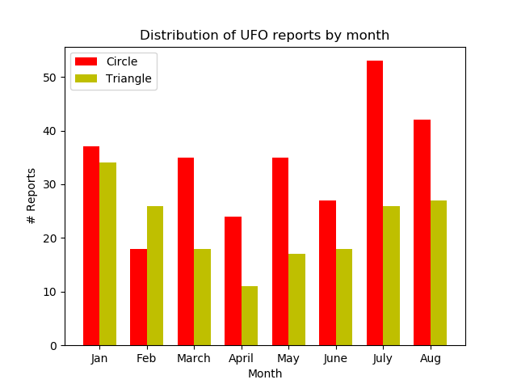
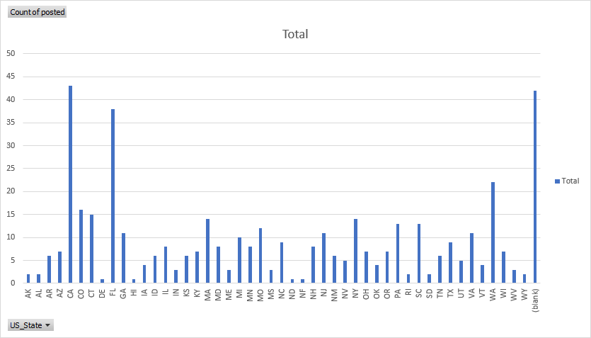

Data Science Homework 2
===
Theodore Bieber
### Part 1

Resources Used
---
Data crawled+saved using https://github.com/RaInta/National_UFO_Reporting_Center/
Data trimmed using excel conditional statements and row deletions
Charts created with matplot.py and excel

